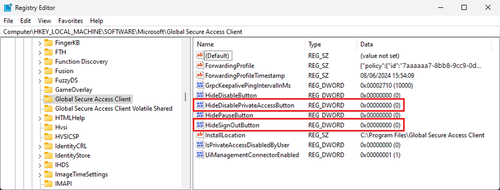
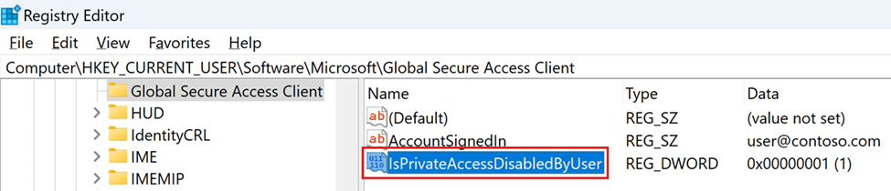

This article describes how administrators can change the default behavior of the Windows Global Secure Access to prevent non-admin users from tampering with the operation.

## Prerequisites
* Microsoft Entra ID P1 License
* Microsoft Entra Private Access or Microsoft Entra Suite License
* Microsoft Entra ID Joined or Microsoft Entra ID Hybrid Joined devices 
* Windows GSA client installed on the device

## Challenge
In its default configuration, the GSA Windows client can be enabled and disabled by end users directly without the need for local administrator permissions. While this might be useful for Microsoft Entra Private Access when users don't want the client to tunnel traffic when connected to the corporate network, it can leave users/devices unprotected in the scenario where users disable the Secure Web Gateway functionality provided by Microsoft Entra Internet Access.

## Default behavior of the client
The GSA Client is shown in the Windows device system tray. Locate the GSA Client icon and right-click to display the available configuration options. By default, these options include 
•	Disable / Enable
•	Collect Logs
•	Advanced Diagnostics


Users can use the Disable / Enable button to start and stop the GSA client with all its services, including Microsoft Entra Private Access and Microsoft Entra Internet Access.

**Note**: The "Collect logs" and "Advanced diagnostic" functions require local admin permission to start due to sensitive data being collected.

Independent of the tray icon buttons, the end user by default has permission to start / stop the service on the Windows machine.

## Hiding GSA Client context menu options

The first level of hardening the client is to hide or show certain options in the GSA Client context menu located in the Windows system tray. To do this, there are several options to change the registry keys in Windows which require local administrator permission.


[The Global Secure Access client for Windows - Global Secure Access | Microsoft Learn](https://learn.microsoft.com/entra/global-secure-access/how-to-install-windows-client#hide-or-unhide-system-tray-menu-buttons)

The administrator can show or hide specific buttons in the client system tray icon menu. Create the values under the following registry key:
```
Computer\HKEY_LOCAL_MACHINE\SOFTWARE\Microsoft\Global Secure Access Client
```

|Value|Type|Data|Default behavior|Description
| ------ | ------ | ------ | ------ | ------ |
HideSignOutButton |	REG_DWORD |	0x0 - shown / 0x1 - hidden | Hidden  | Configure this setting to show or hide the Sign out action. This option is for specific scenarios when a user needs to sign in to the client with a different Entra user than the one used to sign in to Windows. Note: You must sign in to the client with a user in the same Entra tenant to which the device is joined. You can also use the Sign out action to reauthenticate the existing user. |
HideDisablePrivateAccessButton | REG_DWORD | 0x0 - shown / 0x1 - hidden | Hidden | Configure this setting to show or hide the Disable Private Access action. This option is for a scenario when the device is directly connected to the corporate network and the user prefers accessing private applications directly through the network. |



 
The **HideDisablePrivateAccessButton** registry key can help in the scenario where administrators want to give users the ability to pause / disable Microsoft Entra Private Access while having the GSA client tunnelling Internet traffic.
 
**Important** Hiding the tray icon does not change the permissions of the user. The user can still start / stop the GSA services. This method only hides the buttons to do this. 

## Changing permissions to prevent users stopping the GSA client

As described in the previous chapter, hiding the tray icons is an easy way to change the GSA client behavior, but it is not protecting the service from tampering by the user.

### Restrict non-privileged users (client version 2.2.158 and later)
Administrators can prevent non-privileged users on the Windows device from disabling or enabling the client by setting the registry key:

```
Computer\HKEY_LOCAL_MACHINE\Software\Microsoft\Global Secure Access Client
````

|Value|Type|Data|Default behavior|Description
| ------ | ------ | ------ | ------ | ------ |
RestrictNonPrivilegedUsers | REG_DWORD | 0x0 / 0x1 | 0x0 | 0x0 - Non-privileged users on the Windows device can disable and enable the client. 0x1 - Non-privileged users on the Windows device are restricted from disabling and enabling the client. Disabling or Enabling the client will require administrative permissions. The administrator may also hide the disable button. |

### Disable the GSA client via the registry key

Administrators can disable or enable Private Access for the user by setting the registry key:
```
Computer\HKEY_CURRENT_USER\Software\Microsoft\Global Secure Access Client
```

|Value|Type|Data|Description
| ------ | ------ | ------ | ------ |
IsPrivateAccessDisabledByUser | REG_DWORD | 0x0 | Private Access is enabled on this device Network traffic to private applications goes through Global Secure Access.|
IsPrivateAccessDisabledByUser | REG_DWORD | 0x1 | Private Access is disabled on this device. Network traffic to private applications goes directly to the network.



If the registry value doesn't exist, the default value is 0x0, Private Access is enabled.

