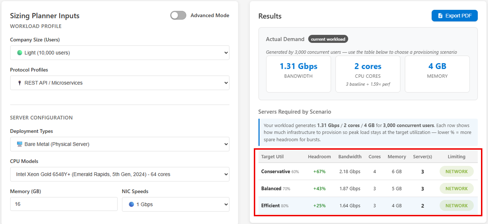

## Overview

Before deploying Entra Private Access at scale, organizations should plan to proper sizing and capacity of their Private Network Connectors. To provide a presecriptive sizing estimate, our team has built the GSA Private Access Sizing Planner. This open-source tool allows you to input data such as the number of users who will be using Private Access, server specifications, NIC throughput capacity, etc. and generates an estimate of how many servers you will need to sufficiently handle your organization's network traffic. 

You can access the tool at https://aka.ms/gsaPAPlanner.

Microsoft's official sizing guidance can be found [here](https://learn.microsoft.com/entra/global-secure-access/concept-connectors#specifications-and-sizing-requirements). 

---