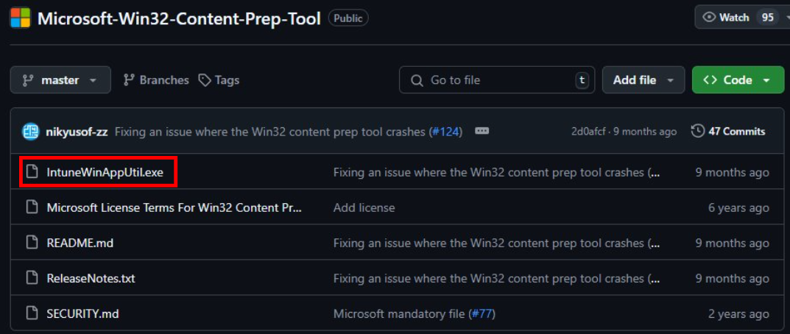
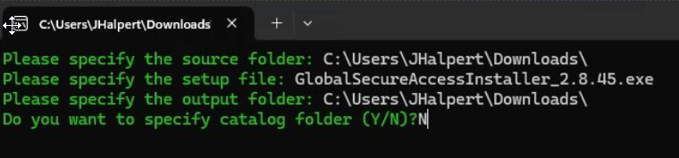

## Manually install Global Secure Access Client on your Windows 10/11 client device

Microsoft Entra Internet Access for Microsoft Traffic and Microsoft Entra Private Access use the Global Secure Access Client on Windows devices. This client acquires and forwards network traffic to Microsoft's Security Service Edge Solution.

1. Make sure your Windows device is Microsoft Entra joined or hybrid joined.
2. Sign in to the Windows device with a Microsoft Entra user role that has local admin privileges.
3. Open the [Microsoft Entra admin center](https://entra.microsoft.com) using an identity assigned the Global Secure Access Administrator role.
4. Go to **Global Secure Access** > **Connect** > **Client Download**. Select **Download client** and complete the installation.

 
5. In the Window taskbar, the Global Secure Access Client first appears as disconnected. After few seconds, you'll be prompted to sign in.

6. In the Window taskbar, double-click the Global Secure Access Client icon and verify **Connected** status.

7. In the Window taskbar, right-click the Global Secure Access Client.

8. Select **Advanced Diagnostics** to view **Global Secure Access Client Connection Diagnostics**. Click **Health check** and verify that all checks show **Yes** status.

## Deploy GSA Client with Intune 

### Pre-requisites 

- A security group with devices or users to identify where the GSA client will be installed. 

### Package the client 

You must convert the .exe file to a .intunewin file. To do this: 

1. Download the Global Secure Access client from the [Entra Portal](https://entra.microsoft.com) > **Global Secure Access** > **Connect** > **Client Download** > Select **Download Client** under Windows 10/11.
2. Go to https://github.com/Microsoft/Microsoft-Win32-Content-Prep-Tool and click **IntuneWinAppUtil.exe**. 

3. In the top right corner, click the ellipsis and select **Download**. 

4. Navigate to and run IntuneWinAppUtil.exe. A command prompt should open. 
5. Enter the folder path where the Global Secure Access .exe file is located and press **Enter**. 
6. Enter the name of the Global Secure Access .exe file and press **Enter**. 
7. Enter the folder path of where you want the .intunewin placed and press **Enter**. 
8. Enter **N** and press **Enter**. 

You now have the .intunewin file ready to be deployed by Microsoft Intune. 

### Deploy Global Secure Access client via Intune 

Refer to [Add and assign Win32 apps to Microsoft Intune](https://learn.microsoft.com/en-us/mem/intune/apps/apps-win32-add#add-a-win32-app-to-intune)

1. Navigate to https://intune.microsoft.com 
2. Select **Apps** > **All apps** > **Add**. 
3. On the **Select app type** pane, under the **Other** app types, select **Windows app (Win32)**. 
4. Click **Select**. The **Add app** steps appear. 
5. Click **Select app package file**. 
6. Click the blue folder and open the .intunewin file you created in the previous section. 

7. Click **OK**. 
8. Enter the following fields: 
- Name : Enter a name for the client app 
- Description : Enter a description 
- Publisher : Enter “Microsoft” 
- (optional) App Version : Enter the version of the client 
9. You may leave the remaining fields with their default values. Click **Next**. 

10. Enter the following fields: 
- Install command : Using the original name of the .exe file enter the following value: **“OriginalNameOfFile.exe” /install /quiet /norestart**
- Uninstall command : Using the original name of the .exe file enter the following value: **“OriginalNameOfFile.exe” /uninstall /quiet /norestart**
- Allow available uninstall : Set to **No** 
- Install behavior : **System**
- Device restart behavior : **Determine behavior based on return codes**

| Return Code | Code Type |
|-----|-----|
| 0 | Success |
| 1707 | Success |
| 3010 | Success |
| 1641 | Success |
| 1618 | Retry |

> **_NOTE:_** The Return Codes are populated with default Windows Exit codes. In this case, we’ve changed 2 of the code types to “Success” to avoid the possibility of unnecessary device reboots. 

11. Click **Next**. 
12. Enter the following fields: 
- Operating system architecture : Select your minimum requirements
- Minimum operating system : Select your minimum requirements

13. Leave the remaining fields blank and click **Next**. 
14. Under **Rules format**, select **Manually configure detection rules**. 
15. Click **Add**. 
16. Under **Rule type**, select **File**. 
17. Enter the following fields: 
- Path : **C:\Program Files\Global Secure Access Client\TrayApp**
- File or folder : **GlobalSecureAccessClient.exe**
- Detection method : **String (version)**
- Operator : **Greater than or equal to**
- Value : Enter the client version number
- Associated with a 32-bit app on 64-bit client : **No** 

18. Click **OK**. Click **Next**. 
19. Click **Next** two more times to get to the **Assignments** tab. 
20. Under **Required** click **+Add group**. Select a group of users or devices and click **Select**. 
21. Click **Next**. Click **Create**. 

### Update the client to a newer version 

You can update to the newest client version by [updating the existing Windows 32 app](https://learn.microsoft.com/en-us/mem/intune/apps/lob-apps-windows#update-a-line-of-business-app). When you do this, be sure to update the following settings in addition to uploading the new .intunewin file: 
- The client version (step #8) 
- The install and uninstall commands (step #10) 
- The detection rule value (step #17e) - set to the new client version number 

However, doing this is a “big bang” approach. In a production environment, it is best practice to deploy new client versions in a phased deployment approach.  
1. Leave the existing app in place for now. 
2. Add a new app for the new client version, repeating the same steps listed above.  
3. Assign the new app to a small group of users that will pilot the new client version. 

> **_NOTE:_** It is okay if these users are also assigned to the app with the old client version. An in-place upgrade will be carried out. 

4. Slowly increase the membership of this group until you’ve deployed the new client to all desired devices. 
5. You may now delete the app with the old client version. 

 