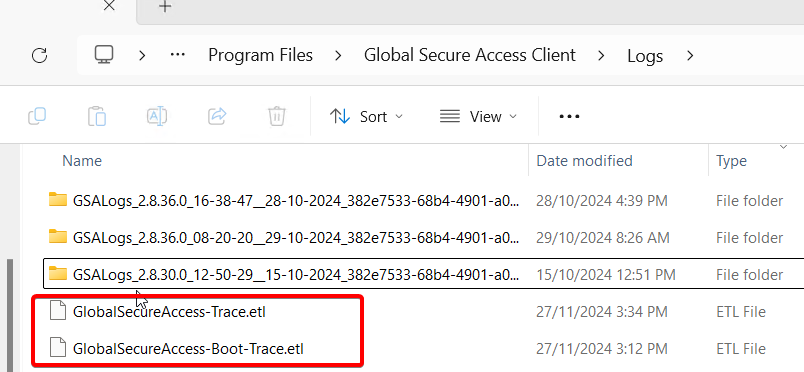

## Windows GSA

### How to get GSA client logs

#### If you can reproduce your issue

If the issue can be reproduced the best way to collect logs is by opening Advanced Diagnostics, selecting Advanced Log Collection, and clicking Start Recording. Reproduce your issue, then click Stop Recording.


Advanced Log Collection gathers diagnostic additional information including **a network capture (pcap)** which can be very useful for troubleshooting.

#### If you cannot reproduce the issue

For times when the issues cannot be reproduced at will, you can instruct users to simply right-click the GSA tray icon and click Collect Logs. This log collection will include the last several hours of GSA activity logs.


### Do not delete these files!

These 2 ETL files are GSA circular logs. They are in the "C:\Program Files\Global Secure Access Client\Logs" folder which is where GSA creates the zip file when the user collects logs as described above.
During troubleshooting, it's very common for people to want to "start clean" and delete old logs. Deleting these files might remove important information for troubleshooting and can cause issues collecting further logs. Please don't delete those ETLs.
It's safe to clean up the zip files.



### Files collected

|File|Description|
|----|----|
|Application-Crash.evtx|Application log filtered by event ID 1001, useful if services are crashing|
|BindingNetworkDrivers.txt| Result of "Get-NetAdapterBinding -AllBindings -IncludeHidden" showing all the modules bound to net adapters. Useful to identify if non-Microsoft drivers are hooked into the network stack|
|ClientChecker.log|Results of the GSA client health checks, easier to read if you load the zip file in your own GSA client (see below section)|
|DeviceInformation.log|Environment variables, OS version, GSA client version, etc.|
|dsregcmd.txt| Output of dsregcmd /status, showing device state (Entra Joined, Hybrid Joined), PRT info, Hello for Business info, etc|
|filterDriver.txt| Windows Filtering Platform filters|
|ForwardingProfile.json| The json policy that was delivered to the GSA client. This contains good info not displayed anywhere else, like the edge address your GSA client is connecting to *.globalsecureaccess.microsoft.com. The rest is displayed on the client in the Forwarding Profile tab|
|GlobalSecureAccess-Boot-Trace.etl|GSA client debug logging|
|GlobalSecureAccess-Boot-Trace.etl|GSA client debug logging|
|Multiple .reg files|Relevant registry exports|
|hosts|Host file|
|installedPrograms.txt|Installed apps on Windows. Useful to understand what else is installed and might be causing issues|
|ipconfig.txt| Ipconfig /all output, useful to understand what IP, DNS servers have been assigned to the device|
|Kerberos_info.txt|Output of klist, klist tgt, klist cloud_debug, useful for troubleshooting kerberos issues, and SSO with WHfB|
|LogsCollectorLog.log and LogsCollectorLog.log.x|Logs for the log collector process. Useful if you are having issues as part of the GSA log collection|
|Multiple .evtx| Exports of multiple Windows event logs|
|NetworkInformation.log| Output of route print, NRPT table, and latency results for GSA connectivity test. Useful to troubleshoot NRPT issues.|
|RunningProcesses.log|Running processes|
|systeminfo.txt|System information including hardware, OS versions, patches, etc|
|systemWideProxy.txt|Output of netsh winhttp show proxy|
|userConfiguredProxy|Output of proxy settings in the registry|
|userSessions.txt|User session list|

Advanced Log Collection also collects the following

|File|Description|
|----|----|
|DNSClient.etl|DNS client logs, very useful to diagnose DNS resolution issues. Open with Event Log viewer, or filter to the specific names of interest with PowerShell: Get-WinEvent -Path .\DNSClient.etl -Oldest \| where Message -Match **replace with name/FQDN** \| Out-GridView|
|InternetDebug.etl|Logs collected using "netsh trace start scenario=internetClient_dbg capture=yes persistent=yes"|
|NetworkTrace.etl|Net capture taken with pktmon|
|NetworkTrace.pcap|Network capture including traffic inside the tunnel|
|NetworkTrace.txt|Pkmon trace in text format|
|wfplog.cab|Windows Filtering Platform logs|

### Useful WireShark filters

Some times it's very useful to look at traffic inside the GSA tunnels. A regular network capture will only show encrypted traffic. This is where the advanced log collecting becomes very useful as it captures a network capture you can analyze with WireShark.

Some useful filters:

See DNS traffic in the tunnel:
Private DNS always uses a DNS server with IP 6.6.255.254, so this filter show Private DNS queries that ultimately get resolved by on-prem private connectors:

```
dns && ip.addr == 6.6.255.254
```

### How to analyse GSA client logs on a different device
After collecting the logs, they can be loaded on a different device with the GSA client by clicking the following option on the Advanced Diagnostic tool:


This will give you the ability to load the zip file collected from a different device or the GlobalSecureAccess-Trace.etl file which contains flow diagnostic information. The benefit of loading the zip file is that the tool will also load tenant ID, device ID, client version, health check, forwarding profile rules, etc. just like if you were troubleshooting locally on the device.

